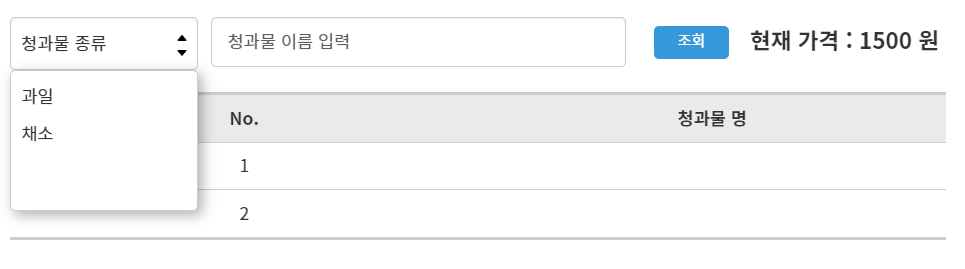
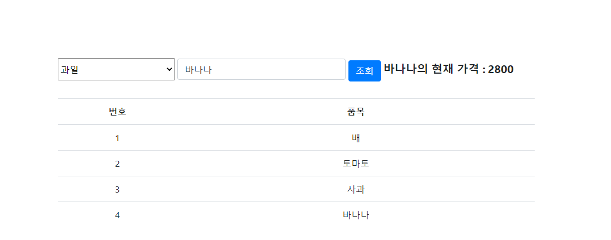

## 개요

- 실시간 과일, 채소 가격을 조회할 수 있는 API 중계 웹 서버 어플리케이션을 개발
---
## 실행 방법

TODO

---

## 요구사항 정리

### API 개발

- [X] access token 발급
  - [X] 과일 가게
  - [X] 채소 가게
- [X] 목록 조회
  - [X] 과일 목록
  - [X] 채소 목록
- [X] 가격 조회
  - [X] 과일 가격
  - [X] 채소 가격
- [ ] 기타
  - [X] api 주소 인코딩
  - [X] 예외 처리 
  - [X] 파라미터 Validation
  - [ ] Swagger 문서화
  - [ ] 도커 컴포즈
  - [X] 토큰 관리  
    - [X] 토큰을 remote 저장소에 저장
  
### 브라우저
데모 


실제 화면

- [X] 상품의 분류를 선택할 수 있는 기능 제공
  - [X] 채소/과일 드롭다운 제공
  - [X] 상품 목록 테이블
    - [X] 채소 목록 불러오기
    - [X] 과일 목록 불러오기
- [X] 상품의 분류를 선택한 뒤 이름을 입력하여 조회 버튼 클릭시 현재 가격 제공하는 기능
  - [X] 입력폼
  - [X] 조회
  - [X] 현재가격 출력
---
## 개발 환경

- IDE : IntelliJ
- OS : Window 10
---
## 기술 스택

- Java 11
- Spring Boot 2.5.4
- Spring Data Redis  
- Thymeleaf
- Lombok
---
## API Docs

TODO

---
## 고려 사항
- API 확장성
  - 상품별 다른 기능이 추가될 때
  - 새로운 상품군이 추가될 때  
- API 부하 절감
  - Redis 캐시를 통해 Token 발급 요청 감소
---
### 커밋 컨벤션

[Angular JS Commit Message conventions](https://gist.github.com/stephenparish/9941e89d80e2bc58a153#allowed-type) 을 따른다.

```text
- feat (feature)
- fix (bug fix)
- docs (documentation)
- style (formatting, missing semi colons, …)
- refactor
- test (when adding missing tests)
- chore (maintain)
```