## 개요

- 실시간 과일, 채소 가격을 조회할 수 있는 API 중계 웹 서버 어플리케이션을 개발
---

## 디렉토리 구조
```
📦src
 ┣ 📂main
 ┃ ┣ 📂java
 ┃ ┃ ┗ 📂kim
 ┃ ┃ ┃ ┗ 📂sihwan
 ┃ ┃ ┃ ┃ ┗ 📂mission
 ┃ ┃ ┃ ┃ ┃ ┣ 📂api -> 인터페이스
 ┃ ┃ ┃ ┃ ┃ ┃ ┣ 📂impl -> 인터페이스 구현체
 ┃ ┃ ┃ ┃ ┃ ┃ ┃ ┣ 📜FruitImpl.java
 ┃ ┃ ┃ ┃ ┃ ┃ ┃ ┗ 📜VegetableImpl.java
 ┃ ┃ ┃ ┃ ┃ ┃ ┣ 📜FruitApi.java
 ┃ ┃ ┃ ┃ ┃ ┃ ┣ 📜RootApi.java
 ┃ ┃ ┃ ┃ ┃ ┃ ┗ 📜VegetableApi.java
 ┃ ┃ ┃ ┃ ┃ ┣ 📂config -> 설정파일
 ┃ ┃ ┃ ┃ ┃ ┃ ┣ 📂redis -> Embedded Redis 설정
 ┃ ┃ ┃ ┃ ┃ ┃ ┃ ┣ 📜EmbeddedRedisConfig.java
 ┃ ┃ ┃ ┃ ┃ ┃ ┃ ┗ 📜EmbeddedRedisRepositoryConfig.java
 ┃ ┃ ┃ ┃ ┃ ┃ ┣ 📂swagger -> Swagger2 설정
 ┃ ┃ ┃ ┃ ┃ ┃ ┃ ┗ 📜SwaggerConfig.java
 ┃ ┃ ┃ ┃ ┃ ┃ ┗ 📜WebConfig.java
 ┃ ┃ ┃ ┃ ┃ ┣ 📂controller -> 컨트롤러 
 ┃ ┃ ┃ ┃ ┃ ┃ ┣ 📜FruitController.java
 ┃ ┃ ┃ ┃ ┃ ┃ ┣ 📜TypeController.java
 ┃ ┃ ┃ ┃ ┃ ┃ ┣ 📜VegetableController.java
 ┃ ┃ ┃ ┃ ┃ ┃ ┗ 📜ViewController.java
 ┃ ┃ ┃ ┃ ┃ ┣ 📂dto -> 응답 DTO
 ┃ ┃ ┃ ┃ ┃ ┃ ┗ 📂response
 ┃ ┃ ┃ ┃ ┃ ┃ ┃ ┣ 📜FruitResponseDto.java
 ┃ ┃ ┃ ┃ ┃ ┃ ┃ ┣ 📜TypeResponseDto.java
 ┃ ┃ ┃ ┃ ┃ ┃ ┃ ┗ 📜VegetableResponseDto.java
 ┃ ┃ ┃ ┃ ┃ ┣ 📂exception -> 사용자 정의 예외 
 ┃ ┃ ┃ ┃ ┃ ┃ ┣ 📂customException
 ┃ ┃ ┃ ┃ ┃ ┃ ┃ ┣ 📜ApiCookieException.java
 ┃ ┃ ┃ ┃ ┃ ┃ ┃ ┣ 📜ApiServerException.java
 ┃ ┃ ┃ ┃ ┃ ┃ ┃ ┣ 📜BlankParameterException.java
 ┃ ┃ ┃ ┃ ┃ ┃ ┃ ┣ 📜FruitNotFoundException.java
 ┃ ┃ ┃ ┃ ┃ ┃ ┃ ┣ 📜InvalidProductTypeException.java
 ┃ ┃ ┃ ┃ ┃ ┃ ┃ ┣ 📜UnknownServerException.java
 ┃ ┃ ┃ ┃ ┃ ┃ ┃ ┗ 📜VegetableNotFoundException.java
 ┃ ┃ ┃ ┃ ┃ ┃ ┣ 📂dto
 ┃ ┃ ┃ ┃ ┃ ┃ ┃ ┗ 📜ErrorResponseDto.java
 ┃ ┃ ┃ ┃ ┃ ┃ ┣ 📜ErrorCode.java -> Enum 으로 관리
 ┃ ┃ ┃ ┃ ┃ ┃ ┗ 📜GlobalExceptionHandler.java -> 사용자 정의 예외를 전역으로 처리
 ┃ ┃ ┃ ┃ ┃ ┣ 📂service -> 데이터를 요청하는 서비스
 ┃ ┃ ┃ ┃ ┃ ┃ ┣ 📜FruitService.java
 ┃ ┃ ┃ ┃ ┃ ┃ ┗ 📜VegetableService.java
 ┃ ┃ ┃ ┃ ┃ ┣ 📂util -> 상품 유형, URL 복호화, 암호화된 URL 관리
 ┃ ┃ ┃ ┃ ┃ ┃ ┣ 📜CustomDecoder.java
 ┃ ┃ ┃ ┃ ┃ ┃ ┣ 📜ProductType.java
 ┃ ┃ ┃ ┃ ┃ ┃ ┗ 📜UrlType.java
 ┃ ┃ ┃ ┃ ┃ ┗ 📜MissionApplication.java
 ┃ ┗ 📂resources
 ┃ ┃ ┣ 📂templates
 ┃ ┃ ┃ ┗ 📜main.html
 ┃ ┃ ┗ 📜application.properties
 ┗ 📂test
 ┃ ┗ 📂java
 ┃ ┃ ┗ 📂kim
 ┃ ┃ ┃ ┗ 📂sihwan
 ┃ ┃ ┃ ┃ ┗ 📂mission
 ┃ ┃ ┃ ┃ ┃ ┣ 📂controller -> 통합 테스트
 ┃ ┃ ┃ ┃ ┃ ┃ ┣ 📜FruitControllerTest.java
 ┃ ┃ ┃ ┃ ┃ ┃ ┣ 📜TypeControllerTest.java
 ┃ ┃ ┃ ┃ ┃ ┃ ┗ 📜VegetableControllerTest.java
 ┃ ┃ ┃ ┃ ┃ ┣ 📂service -> 서비스 단 테스트 
 ┃ ┃ ┃ ┃ ┃ ┃ ┣ 📜FruitServiceTest.java
 ┃ ┃ ┃ ┃ ┃ ┃ ┗ 📜VegetableServiceTest.java
 ┃ ┃ ┃ ┃ ┃ ┗ 📜MissionApplicationTests.java

```
---

## 실행 방법

```
git clone https://github.com/Kim-SiHwan/ApiMission.git
cd ApiMission
./mvnw package
cd target
java -jar mission-0.0.1-SNAPSHOT.jar
```

---
## 요구사항 정리

### API 개발

- [X] access token 발급
  - [X] 과일 가게
  - [X] 채소 가게
- [X] 목록 조회
  - [X] 과일 목록
  - [X] 채소 목록
- [X] 가격 조회
  - [X] 과일 가격
  - [X] 채소 가격
- [X] 기타
  - [X] api 주소 인코딩
  - [X] 예외 처리 
  - [X] 파라미터 Validation
  - [X] Swagger 문서화
  - [X] 토큰 관리  
    - [X] 토큰을 remote 저장소에 저장
  
### 브라우저
데모 


실제 화면

- [X] 상품의 분류를 선택할 수 있는 기능 제공
  - [X] 채소/과일 드롭다운 제공
  - [X] 상품 목록 테이블
    - [X] 채소 목록 불러오기
    - [X] 과일 목록 불러오기
- [X] 상품의 분류를 선택한 뒤 이름을 입력하여 조회 버튼 클릭시 현재 가격 제공하는 기능
  - [X] 입력폼
  - [X] 조회
  - [X] 현재가격 출력
  
실행 Flow
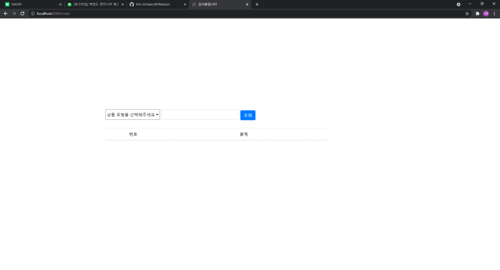
---
## 개발 환경

- IDE : IntelliJ
- OS : Window 10
---
## 기술 스택

- Java 11
- Spring Boot 2.5.4
- Spring Data Redis ( Embedded Redis )
- Thymeleaf
- Swagger2
- Lombok
---
## API Docs
- Swagger API Docs 확인 -> http://localhost:8080/swagger-ui.html#/
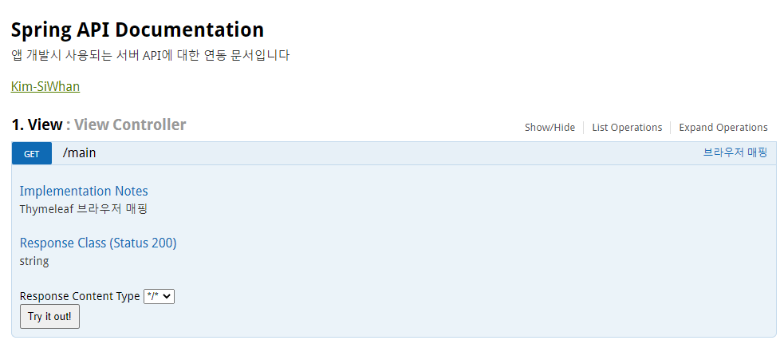

### 타입
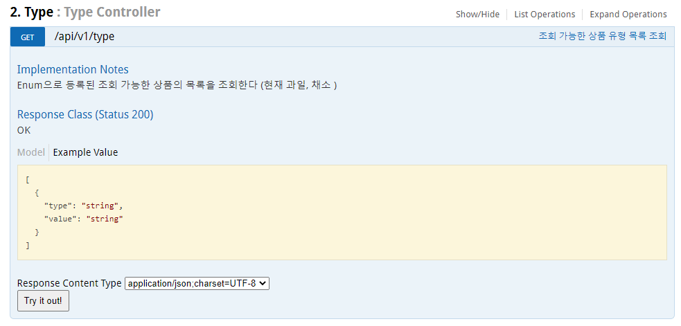


### 과일
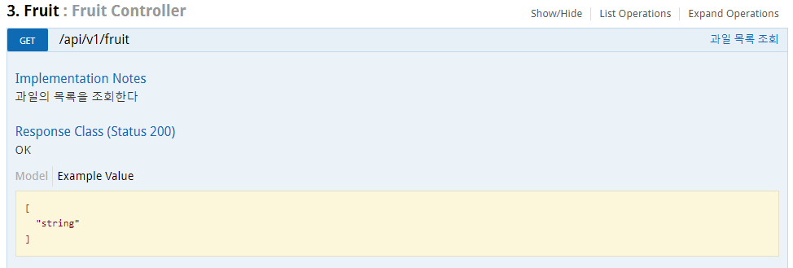
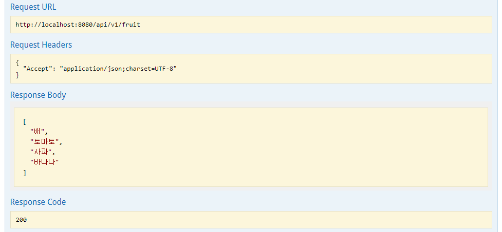
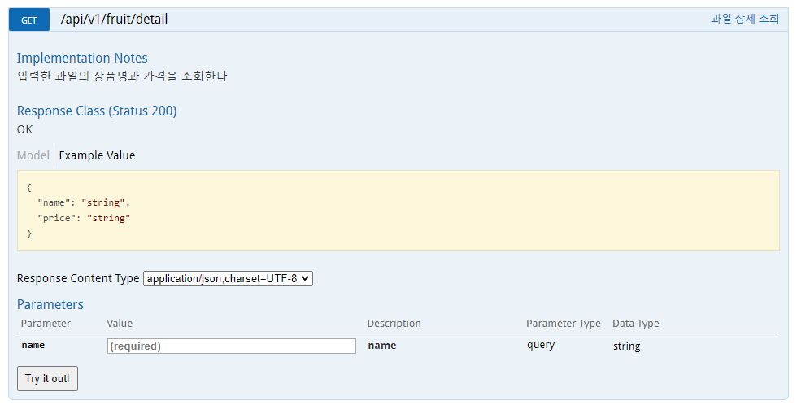
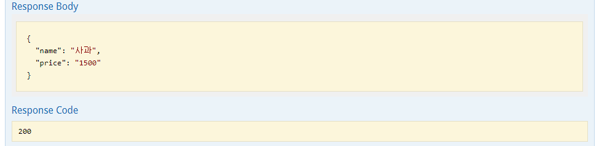

### 채소
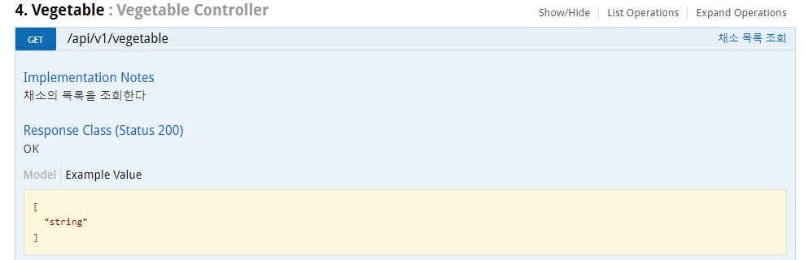
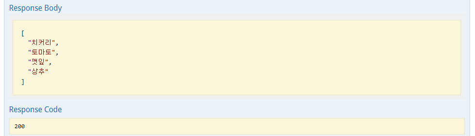
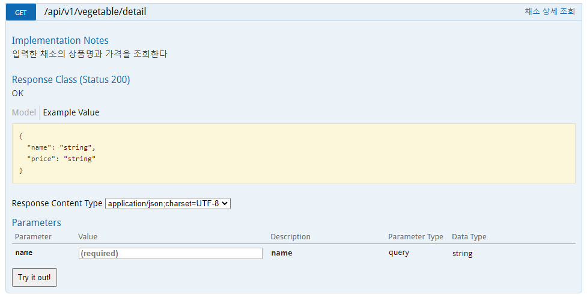
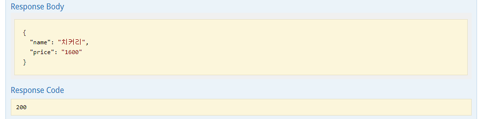

---
## 고려 사항
- API 확장성
  - 상품별 다른 기능이 추가될 때
  - 새로운 상품군이 추가될 때
   
- 캐싱
  - Redis 캐시를 통해 Token 발급 요청 감소
  - Docker compose를 통해 Remote Redis와 Spring Boot를 연결해서 개발했으나 확인 편의성을 위해 Embedded로 변경
  - 추후 확장하게 된다면 Remote 환경으로 구성해서 사용
 
---
### 커밋 컨벤션

[Angular JS Commit Message conventions](https://gist.github.com/stephenparish/9941e89d80e2bc58a153#allowed-type) 을 따른다.

```text
- feat (feature)
- fix (bug fix)
- docs (documentation)
- style (formatting, missing semi colons, …)
- refactor
- test (when adding missing tests)
- chore (maintain)
```
